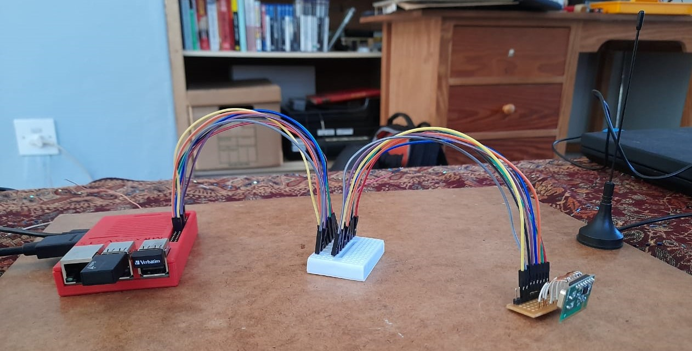

# Wireless USB Hub

This is the Raspberry Pi and CC2500 for ECE Design Project 2020 at UCT

# Requirements

* One Raspberry Pi
* One Quasar QFM-TRX1-24G (with CC2500 on board)
* One radio receiver

Test with:
* Raspberry Pi 3B
* Quasar QFM-TRX1-24G
* Nooelec SDR USB Dongle



# Setup

## Install Dependencies
```
sudo apt install git cmake wiringpi
```

## Connect module

| Raspberry Pi Physical Pin	| Name  	                  | CC2500 PIN 	|
|---	                    |---	                      |---	        |
|   16	                    |  BCM 22 / WiringPi pin 4 	  |   GDO2	    |
|   1                       |  3v3 Power	              |   3.3V	    |
|   19                      |  SPI0 MOSI 	              |   MOSI	    |
|   21                      |  SPI0 MISO                  |   MISO      |
|   23                      |  SPI0 SCLK	              |   RFSCL     |
|   24                      |  SPI0 CE0                   |   RFCS	    |
|   9                       |  GND                        |   GND	    |


# How to use
* Input binary data into the data array found in the file: RaspberryPi_CC2500_interface.c
* Configure a receiver to 900Mhz to receive the data

## Run the example proof of concept program
* This transmits 4 bytes of data

```
./poc
```

# Future Contributions
* Adding networking protocols
* Making Access Point functionality
